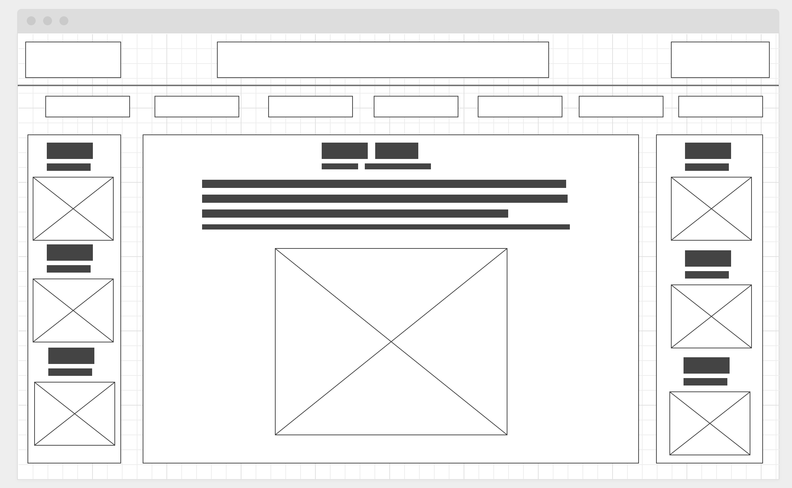

# Adoption Project

## User Stories
* As A user, I want to find an animal to adopt, so I and they can be happy.
* As A user, I want search options to find a pet more directed towards me, so my experience is easier.
* As A user, I want a large variety of animals to choose from, in case the ones presented are not my type.
* As A user, I want to be able to find an organization or shelter I like, so I can watch for more options in the future from a local place.
* As A user, I want to always be able to search by location, so I don't have to go far for my adoption.

## Technology Used
* Apple Macbook
* Visual Studio Code - code editor used
* Google Chrome
* Command Line - more file manipulation
* https://www.w3schools.com/ - Used VERY frequently, explains things simply but enough for general use.
* https://developer.mozilla.org/en-US/ - Similar to w3schools, but has more examples and sometimes more detailed explanations.
* https://reactjs.org/ - React documentation, examples, etc.

## Main Features
* 3 'sections' displaying different features
* 
* 
* 

## Unsolved Problems
In the organization feature, when using Next or Previous in the case where it hits the beginning or the end of the array it's using, it sometimes skips an item. (usually index 0) I think it is rendering before the index updates, or my loop is slightly off.
There are also minor error messages that do not break the code, I should think about how to refactor these.
